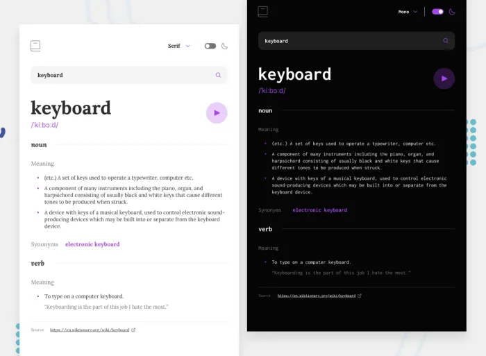

# DICTIONARY

Dictionary is the author implementation of the [Dictionary challenge](https://www.frontendmentor.io/challenges/dictionary-web-app-h5wwnyuKFL) of [frontenmentor.com](https://www.frontendmentor.io)

## Requirements

- Use semantic HTML tags.
- Apply best practices in HTML code.
- Use CSS selectors correctly.
- Use CSS box model.
- Use Flexbox to place elements in the page.
- Demonstrate ability to create UIs adaptable to different screen sizes using media queries.
- Use GitHub Pages to deploy web pages.
- Apply JavaScript best practices and language style guides in code.
- Use JavaScript to manipulate DOM elements.
- Use JavaScript events.
- Communicate technical concepts to other technical people.

## Tasks to do

- ### Styling

- #### Desktop

- #### Tablet

- #### Mobile

- 

- ### Refactoring

## Live Demo

[Live demo](http://davidlafontant.tech/dictionnary/)

## Built With

- HTML, CSS, JavaScript, GIT, & SASS.
- Technologies used: GitHub, VScode, Windows 11 .

## Video Preview

## Getting Started

To get a local copy up and running follow these simple example steps.

### Prerequisites

- A device that support running browser applications.
- access to internet connection.
- An ide (like VSCode or Atom)

#### Install locally the code of the application

In order to install a local version of this project and please do the following steps:

- Install the latest version of a Code editor.
- install the latest version of GIT.
- Go to the repository [Repository](https://github.com/david-lafontant/dictionnary.git)
- Clone the repository with `git clone https://github.com/david-lafontant/dictionnary.git`
- then `cd dictionnary`
- Use your favorite code editor or IDE and Play with the code and enjoy :confetti_ball:

## Author

👤 **David Lafontant**

- GitHub: [@githubhandle](https://github.com/david-lafontant)
- Twitter: [@twitterhandle](https://twitter.com/manikatex)
- Linkedin: [@linkedinhandle](src\assets\images\readme-assets\model.webp)

## 🤝 Contributing

Contributions, issues, and feature requests are welcome!

Feel free to check the [issues page](../../issues/).

## Show your support

Give a ⭐️ if you like this project!

## Acknowledgments

## Other Resources

## 📝 License

This project is [MIT](LICENCE.md) licensed.

<!-- https://deeditor.com/ for colorizing svg -->
